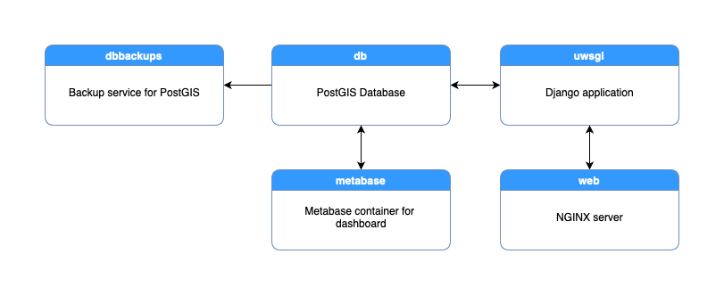

# Introduction

This directory contains the source code for the hub repository server used by
the QGIS project.

This software is open source and licensed under GNU General Public License v2.0.
For licensing information, please read the COPYING file included in this directory.

## Installation

For setup, installation and backup notes, please read [INSTALL](INSTALL.md) included in this directory.

To contribute to this project, please contact Tim Sutton - tim@kartoza.com

QGIS Django Project
Tim Sutton 2010

## Tech stack

This application is based on Django, written in Python and deployed on the server using
docker-compose.

## Contributing

Please contact tim@kartoza.com if you want to contribute, or simply make a Pull Request or Issue report.

## QGIS.org

This project is part of the QGIS community effort to make the greatest GIS application in the world.
Join our efforts at [QGIS.org](https://qgis.org).
